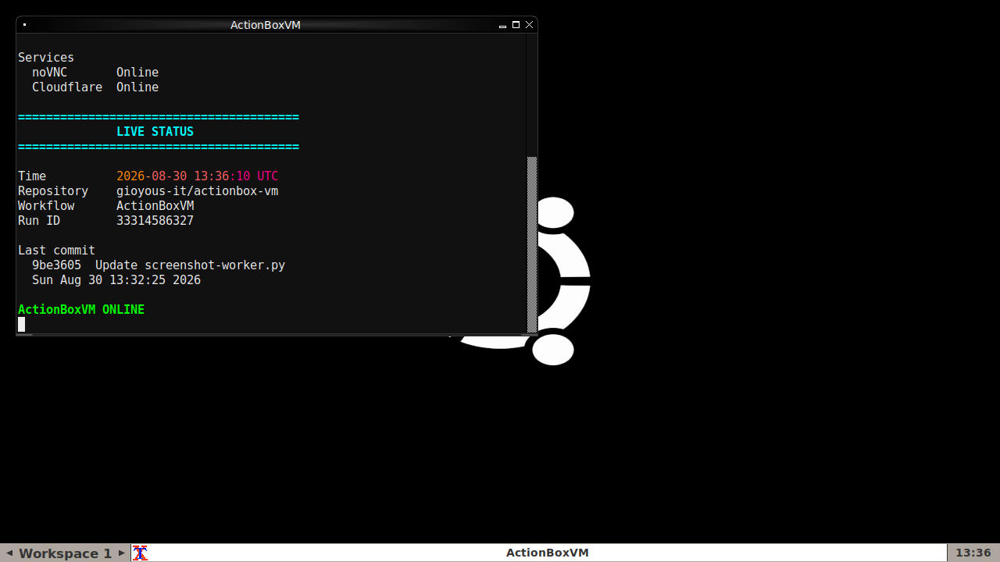

ActionBoxVM

A temporary graphical Linux desktop powered by GitHub Actions.

ActionBoxVM provides an Ubuntu desktop environment running inside a GitHub Actions runner, with access through VNC and noVNC.

Every ActionBoxVM session starts from a clean GitHub-hosted environment and remains available while its workflow job is running.

Live Desktop (Screenshot updated every 5 minutes)

[noVNC](https://session-dolls-motorcycle-bug.trycloudflare.com/vnc.html?autoconnect=true&resize=remote) — Control ActionBoxVM from your Browser

The VNC link above is updated automatically whenever a new ActionBoxVM session starts.

«The access address is temporary and changes between sessions.»

Status

[View the current ActionBoxVM status](STATUS.txt).

The status file is automatically updated with information about the current session, including its access address and environment.

Features

- Ubuntu-based environment
- Fluxbox desktop
- Xvfb virtual display
- Xterm terminal
- VNC access
- noVNC browser access
- Cloudflare Quick Tunnel
- Git and common command-line utilities
- Python 3
- Basic development utilities
- System monitoring tools
- Automatic desktop screenshots
- Automatic status updates
- Automatic repository updates

Included Software

ActionBoxVM includes a small collection of useful tools so the environment is ready to explore immediately.

Development

- Git
- Python 3
- pip
- GCC
- Make
- Build tools
- Python development headers

Command-line Utilities

- curl
- wget
- jq
- tree
- file
- tar
- gzip
- bzip2
- xz
- zip
- unzip

System Utilities

- htop
- btop
- procps
- psmisc
- pciutils
- usbutils
- iproute2
- iputils
- net-tools
- DNS utilities

Editors

- nano
- Vim
- less

Desktop

The graphical environment consists of:

Ubuntu
  │
  ├── Xvfb
  │
  ├── Fluxbox
  │
  └── Xterm
        │
        └── ActionBoxVM tools

The virtual display runs at:

1280 × 720

The same X display is exposed through VNC and used by the screenshot service.

Screenshots

"0.png" is automatically refreshed every 5 minutes while the ActionBoxVM session is running.

The screenshot service runs inside the same GitHub Actions runner as the desktop. This means the image represents the actual ActionBoxVM desktop rather than a separate screenshot environment.

Session Lifetime

ActionBoxVM runs on a GitHub-hosted Actions runner.

A new session is scheduled every 12 hours.

The desktop remains available for the lifetime of its workflow job, subject to GitHub Actions runner and workflow limits.

When the runner is terminated, the desktop and its temporary access address disappear with it.

Security

ActionBoxVM is intended for experimentation and demonstration.

The VNC service is configured without a password because access is provided through a temporary noVNC address.

Do not enter passwords, API keys, tokens, private files, or other sensitive information into ActionBoxVM.

Treat every session as disposable.

Repository Updates

ActionBoxVM automatically updates:

0.png
STATUS.txt
README.md

The workflow commits these changes back to the repository using the GitHub Actions bot account.

Running ActionBoxVM

1. Open the Actions tab.
2. Select ActionBoxVM.
3. Start the workflow manually, or wait for its scheduled run.
4. Open the generated VNC address from the workflow output or repository README.
5. Use the desktop through your browser.

License

ActionBoxVM is released under CC0 1.0 Universal.

You can use, modify, copy, redistribute, and incorporate the project into other projects without permission.

---

ActionBoxVM

Ubuntu · Fluxbox · Xvfb · VNC · noVNC · GitHub Actions
